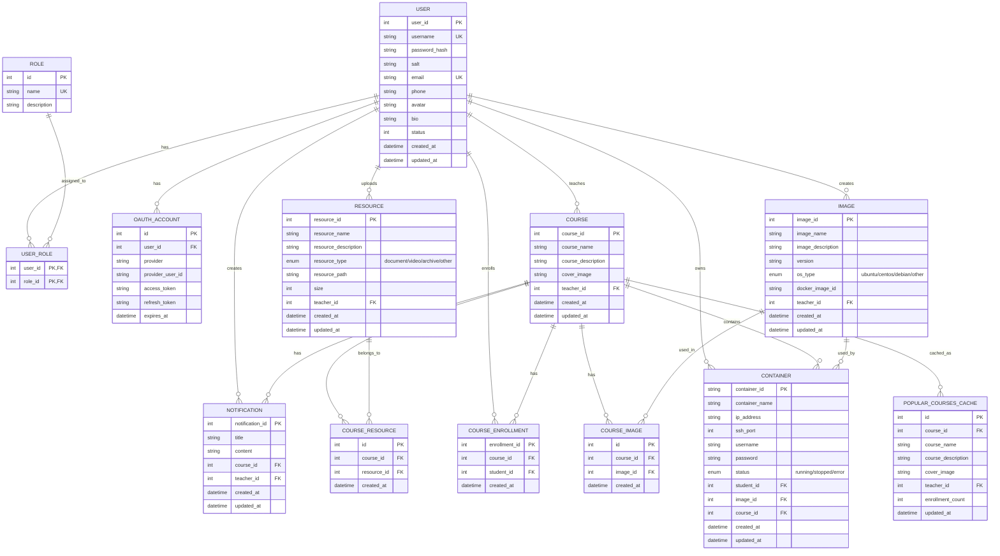

## 1. 需求分析

### 1.1 项目背景
Linux操作系统学习平台旨在为教师和学生提供一个Linux学习环境，通过该平台教师可以提供Linux操作系统的学习资源，学生可以进行Linux操作系统的安装、学习和测试，管理员可以对用户信息等进行管理。

### 1.2 用户角色
- **教师用户**：提供Linux操作系统的学习资源，包括背景资料、安装包链接，Linux系统管理课程资料等, 增删改查班级信息，增删改查学生信息。
- **学生用户**：通过平台进行Linux操作系统的安装、学习和测试等
- **管理员**：对用户信息, 班级信息, 资源等进行管理

### 1.3 功能需求
#### 1.3.1 学生功能
**用户管理：**

**注册与登录**：
- 用户可以通过邮箱或用户名进行注册和登录。
- 登录后可以修改个人密码和个人信息（如姓名、联系方式等）。

**个人信息管理**：
- 用户可以查看和编辑自己的个人信息，包括头像、简介等。

**首页**

**首页布局**：
- **轮播图**：每天更新并展示当前已选人数最多的几个课程，吸引学生关注热门课程。
- **最新课程栏**：显示最近添加的课程，点击可进入所有课程列表页面。
- **课程列表**：所有课程列表支持多选操作，方便学生批量选课。

每个课程可进入查看详情，查看课程介绍，课程老师发布的资源（只有选课后才可以下载）。

首页同样展示已选课程，同样也是点击进入全部已选课程页面。已选课程列表支持批量选中退课。

**课程详情**

**未选课状态**：
- 查看课程介绍页面，了解课程的基本信息和目标。
- 课程公告通知
- 查看资源页面，但无法下载资源（需选课后才能访问）。
- 查看Linux镜像，但是不能创建容器。

**已选课状态：**
- 查看课程介绍页面，了解课程的基本信息和目标。
- 课程公告通知
- 查看资源页面，查看和下载教师提供的学习资料，包括文档、视频等。
- Linux环境使用页面：查看已创建的环境，或者新建环境。只能选择老师提供好的环境版本进行启动，获取SSH登录信息，连接到容器进行学习。
   4.1. 对已有的环境进行增删改查。

#### 1.3.2 教师功能

**课程管理**：
- 教师可以创建新的课程，填写课程名称、描述等基本信息。
- 编辑现有课程的信息，包括课程内容、封面图片等。
- 删除不再需要的课程。

课程详情中，可以发布、编辑、删除通知, 可以发布、编辑、删除、资源，可以批量导入、删除选课学生。

**学生管理**：
- 在课程详情的学生管理页面，教师可以查看每个学生名下的环境信息。
- 修改学生的容器，新增或者删除。

同时，课程详情中有镜像管理页面，老师可以查看每个镜像版本下，已经选择该版本的学生。也可以新建镜像。

**资源管理**：
- 教师上传的所有资源都会在这个界面汇总。
- 支持对资源进行编辑和删除操作，资源类型包括文档、视频、压缩包等。
在课程中公布的资源是以引用的形式公布的。（即，学生可以访问教师在班级中公布了的资源链接进行下载，对课程没公布的资源，无权访问）

**镜像管理**：
- 教师可以新建镜像模板，定义不同的Linux发行版及其预装软件。
- 删除镜像模板时，系统会同步删除所有课程中使用该镜像的学生的镜像实例。

#### 1.3.3 管理员功能

**用户管理**：
- 管理员可以增加、删除、修改和查询用户信息及角色。
- 支持批量导入用户信息，提高管理效率。

**资源管理**：
- 查看每个教师名下的资源汇总。
- 支持对资源进行增加、删除、修改和查询操作。

**镜像管理**：
- 查看已启动和存在的镜像，对其进行修改。
- 查看每个选择了该镜像的学生列表，增加或减少可以访问镜像的学生。
- 如果去除了学生对该镜像的访问权限，系统会自动删除该学生所有该镜像的容器实例。

## 2. 系统功能模块设计

### 2.1 系统总体架构
Linux操作系统学习平台采用C++开发，基于B/S架构，分为前端展示层和后端处理层。

#### 2.1.1 前端展示层
- **React**：前端框架，支持组件化开发。
- **Vite**：现代化的前端构建工具，提供快速的开发服务器启动速度和高效的热更新功能。
- **shadcn/ui**：基于Tailwind CSS的现代化UI组件库。
- **Tailwind CSS**：用于样式定制，确保一致性和灵活性。
- **路由**：使用`react-router`管理页面导航。
- **状态管理**：使用`React Context`管理全局状态。

#### 2.1.2 后端处理层
- 使用C++实现核心业务逻辑
- 采用MySQL数据库存储数据
- 使用Docker API管理容器

依赖库
- **JWT验证**：jwt-cpp (https://github.com/Thalhammer/jwt-cpp)
- **HTTP服务器**：Crow (https://github.com/CrowCpp/Crow)
- **JSON处理**：nlohmann/json (https://github.com/nlohmann/json)
- **数据库处理**：MySQL Connector/C++ (https://dev.mysql.com/doc/connector-cpp/en/)
- **日志库**：spdlog (https://github.com/gabime/spdlog)

#### 2.1.3 用户管理鉴权层
- **认证服务**：基于JWT的认证系统，负责用户注册、登录和令牌签发
- **React前端**：用户界面，处理登录流程
- **C++后端API**：业务逻辑实现，包含JWT验证中间件
- **角色权限控制**：基于RBAC(基于角色的访问控制)模型实现权限管理
- **第三方登录支持**：预留OAuth接口，支持未来扩展第三方登录功能

### 2.2 系统功能模块图
```
Linux操作系统学习平台
├── 用户管理模块
│   ├── 注册登录子模块
│   │   ├── 本地账号认证
│   │   └── 第三方登录认证（预留）
│   ├── 个人信息管理子模块
│   └── 角色权限管理子模块
├── 教师功能模块
│   ├── 资源管理模块
│   └── 课程管理模块
├── 学生功能模块
│   ├── 课程学习模块
│   ├── 资源获取模块
│   └── Docker容器管理模块
└── 管理员功能模块
    ├── 用户管理模块
    │   ├── 用户信息管理子模块
    │   └── 角色权限管理子模块
    ├── 系统配置模块
    └── 容器管理模块
        ├── 容器创建子模块
        ├── 容器启停子模块
        ├── 容器删除子模块
        └── 容器信息查看子模块
```

### 2.3 核心功能模块详细设计

#### 2.3.1 用户管理模块
- **注册登录子模块**：实现用户注册、登录功能，支持邮箱或用户名注册，密码加密存储。
- **个人信息管理子模块**：实现用户个人信息查看、编辑功能，包括头像、简介等。

#### 2.3.2 教师功能模块
- **资源管理模块**：实现教学资源上传、编辑、删除功能
- **课程管理模块**：实现课程创建、编辑、删除功能

#### 2.3.3 学生功能模块
- **课程学习模块**：实现课程浏览、搜索功能
- **资源获取模块**：实现学习资料查看、下载功能
- **Docker容器管理模块**：实现Linux发行版选择、容器创建、SSH登录信息获取功能

#### 2.3.4 管理员功能模块
- **用户管理模块**：
    - **用户信息管理子模块**：实现用户信息查看、编辑、删除功能。
    - **角色权限管理子模块**：实现用户角色分配和权限管理。
- **系统配置模块**：实现系统参数设置功能
- **容器管理模块**：
    - **容器创建子模块**：提供界面供管理员创建新的Docker容器。
    - **容器启停子模块**：控制容器的启动和停止状态。
    - **容器删除子模块**：删除不再需要的容器。
    - **容器信息查看子模块**：显示容器的详细信息，包括SSH登录信息。

### 2.4 Docker容器管理功能实现方案

系统将使用Docker容器为每个学生提供独立的Linux环境。具体实现方案如下：

1. **容器创建流程**：
   - 学生登录平台，进入Docker容器管理页面
   - 选择Linux发行版（Ubuntu或CentOS）
   - 点击创建按钮，系统后台调用Docker API创建对应的容器
   - 容器内自动配置SSH服务
   - 创建完成后，系统显示容器的SSH登录信息（IP地址、端口、用户名和密码）
   - 学生使用SSH客户端（如PuTTY、Terminal等）连接到容器进行学习

2. **容器管理功能**：
   - 创建容器：选择Linux发行版，创建新的Docker容器
   - 启动/停止容器：控制容器的运行状态
   - 重启容器：重启容器服务
   - 删除容器：删除不再需要的容器
   - 查看容器信息：显示容器的详细信息，包括SSH登录信息

3. **技术实现**：
   - 使用Docker API或Docker命令行工具创建和管理容器
   - 容器基础镜像预先配置好SSH服务
   - 容器创建时自动生成随机密码，并配置到容器中
   - 使用端口映射将容器内的SSH端口映射到宿主机上

这种方案相比预配置服务器更加灵活，可以根据学生的需求动态创建不同类型的Linux环境，同时资源消耗也比完整的虚拟机要小得多。

## 3. 数据库设计

### 3.1 数据库概念结构设计

#### 3.1.1 实体关系图


### 3.2 数据库逻辑结构设计

#### 3.2.1 表结构设计

1. **用户表(users)**
```sql
CREATE TABLE User (
    user_id INT AUTO_INCREMENT PRIMARY KEY,
    username VARCHAR(50) NOT NULL UNIQUE,
    email VARCHAR(100) NOT NULL UNIQUE,
    password_hash VARCHAR(256) NOT NULL,
    salt VARCHAR(100) NOT NULL,
    phone VARCHAR(20),
    avatar VARCHAR(255),
    bio TEXT,
    status TINYINT DEFAULT 1, -- 1:正常 0:禁用
    created_at TIMESTAMP DEFAULT CURRENT_TIMESTAMP,
    updated_at TIMESTAMP DEFAULT CURRENT_TIMESTAMP ON UPDATE CURRENT_TIMESTAMP
) ENGINE=InnoDB DEFAULT CHARSET=utf8mb4;
```

2. **角色表(roles)**
```sql
CREATE TABLE roles (
    id INT AUTO_INCREMENT PRIMARY KEY,
    name VARCHAR(20) UNIQUE NOT NULL,
    description TEXT
) ENGINE=InnoDB DEFAULT CHARSET=utf8mb4;

-- 预设角色
INSERT INTO roles (name, description) VALUES 
('admin', '管理员'),
('teacher', '教师'),
('student', '学生');
```

3. **用户-角色关联表(user_roles)**
```sql
CREATE TABLE user_roles (
    user_id INT,
    role_id INT,
    PRIMARY KEY (user_id, role_id),
    FOREIGN KEY (user_id) REFERENCES User(user_id) ON DELETE CASCADE,
    FOREIGN KEY (role_id) REFERENCES roles(id) ON DELETE CASCADE
) ENGINE=InnoDB DEFAULT CHARSET=utf8mb4;
```

4. **第三方认证表(oauth_accounts)**
```sql
CREATE TABLE oauth_accounts (
    id INT AUTO_INCREMENT PRIMARY KEY,
    user_id INT NOT NULL,
    provider VARCHAR(20) NOT NULL, -- 'google', 'github', 'wechat'等
    provider_user_id VARCHAR(100) NOT NULL,
    access_token TEXT,
    refresh_token TEXT,
    expires_at TIMESTAMP NULL,
    FOREIGN KEY (user_id) REFERENCES User(user_id) ON DELETE CASCADE,
    UNIQUE KEY provider_user (provider, provider_user_id)
) ENGINE=InnoDB DEFAULT CHARSET=utf8mb4;
```

5. **课程表(courses)**
```sql
CREATE TABLE Course (
    course_id INT AUTO_INCREMENT PRIMARY KEY,
    course_name VARCHAR(100) NOT NULL,
    course_description TEXT,
    cover_image VARCHAR(255),
    teacher_id INT NOT NULL,
    created_at TIMESTAMP DEFAULT CURRENT_TIMESTAMP,
    updated_at TIMESTAMP DEFAULT CURRENT_TIMESTAMP ON UPDATE CURRENT_TIMESTAMP,
    FOREIGN KEY (teacher_id) REFERENCES User(user_id) ON DELETE CASCADE
) ENGINE=InnoDB DEFAULT CHARSET=utf8mb4;
```

6. **课程选修表(CourseEnrollment)**
```sql
CREATE TABLE CourseEnrollment (
    enrollment_id INT AUTO_INCREMENT PRIMARY KEY,
    course_id INT NOT NULL,
    student_id INT NOT NULL,
    created_at TIMESTAMP DEFAULT CURRENT_TIMESTAMP,
    FOREIGN KEY (course_id) REFERENCES Course(course_id) ON DELETE CASCADE,
    FOREIGN KEY (student_id) REFERENCES User(user_id) ON DELETE CASCADE,
    UNIQUE KEY course_student (course_id, student_id)
) ENGINE=InnoDB DEFAULT CHARSET=utf8mb4;
```

7. **通知表(Notification)**
```sql
CREATE TABLE Notification (
    notification_id INT AUTO_INCREMENT PRIMARY KEY,
    title VARCHAR(100) NOT NULL,
    content TEXT NOT NULL,
    course_id INT NOT NULL,
    teacher_id INT NOT NULL,
    created_at TIMESTAMP DEFAULT CURRENT_TIMESTAMP,
    updated_at TIMESTAMP DEFAULT CURRENT_TIMESTAMP ON UPDATE CURRENT_TIMESTAMP,
    FOREIGN KEY (course_id) REFERENCES Course(course_id) ON DELETE CASCADE,
    FOREIGN KEY (teacher_id) REFERENCES User(user_id) ON DELETE CASCADE
) ENGINE=InnoDB DEFAULT CHARSET=utf8mb4;
```

8. **资源表(Resource)**
```sql
CREATE TABLE Resource (
    resource_id INT AUTO_INCREMENT PRIMARY KEY,
    resource_name VARCHAR(100) NOT NULL,
    resource_description TEXT,
    resource_type ENUM('document', 'video', 'archive', 'other') NOT NULL,
    resource_path VARCHAR(255) NOT NULL,
    size INT NOT NULL,
    teacher_id INT NOT NULL,
    created_at TIMESTAMP DEFAULT CURRENT_TIMESTAMP,
    updated_at TIMESTAMP DEFAULT CURRENT_TIMESTAMP ON UPDATE CURRENT_TIMESTAMP,
    FOREIGN KEY (teacher_id) REFERENCES User(user_id) ON DELETE CASCADE
) ENGINE=InnoDB DEFAULT CHARSET=utf8mb4;
```

9. **课程资源关联表(CourseResource)**
```sql
CREATE TABLE CourseResource (
    id INT AUTO_INCREMENT PRIMARY KEY,
    course_id INT NOT NULL,
    resource_id INT NOT NULL,
    created_at TIMESTAMP DEFAULT CURRENT_TIMESTAMP,
    FOREIGN KEY (course_id) REFERENCES Course(course_id) ON DELETE CASCADE,
    FOREIGN KEY (resource_id) REFERENCES Resource(resource_id) ON DELETE CASCADE,
    UNIQUE KEY course_resource (course_id, resource_id)
) ENGINE=InnoDB DEFAULT CHARSET=utf8mb4;
```

10. **镜像表(Image)**
```sql
CREATE TABLE Image (
    image_id INT AUTO_INCREMENT PRIMARY KEY,
    image_name VARCHAR(100) NOT NULL,
    image_description TEXT,
    version VARCHAR(50) NOT NULL,
    os_type ENUM('ubuntu', 'centos', 'debian', 'other') NOT NULL,
    docker_image_id VARCHAR(100) NOT NULL,
    teacher_id INT NOT NULL,
    created_at TIMESTAMP DEFAULT CURRENT_TIMESTAMP,
    updated_at TIMESTAMP DEFAULT CURRENT_TIMESTAMP ON UPDATE CURRENT_TIMESTAMP,
    FOREIGN KEY (teacher_id) REFERENCES User(user_id) ON DELETE CASCADE
) ENGINE=InnoDB DEFAULT CHARSET=utf8mb4;
```

11. **课程镜像关联表(CourseImage)**
```sql
CREATE TABLE CourseImage (
    id INT AUTO_INCREMENT PRIMARY KEY,
    course_id INT NOT NULL,
    image_id INT NOT NULL,
    created_at TIMESTAMP DEFAULT CURRENT_TIMESTAMP,
    FOREIGN KEY (course_id) REFERENCES Course(course_id) ON DELETE CASCADE,
    FOREIGN KEY (image_id) REFERENCES Image(image_id) ON DELETE CASCADE,
    UNIQUE KEY course_image (course_id, image_id)
) ENGINE=InnoDB DEFAULT CHARSET=utf8mb4;
```

12. **容器表(Container)**
```sql
CREATE TABLE Container (
    container_id VARCHAR(100) PRIMARY KEY,
    container_name VARCHAR(100) NOT NULL,
    ip_address VARCHAR(50) NOT NULL,
    ssh_port INT NOT NULL,
    username VARCHAR(50) NOT NULL,
    password VARCHAR(100) NOT NULL,
    status ENUM('running', 'stopped', 'error') NOT NULL,
    student_id INT NOT NULL,
    image_id INT NOT NULL,
    course_id INT NOT NULL,
    created_at TIMESTAMP DEFAULT CURRENT_TIMESTAMP,
    updated_at TIMESTAMP DEFAULT CURRENT_TIMESTAMP ON UPDATE CURRENT_TIMESTAMP,
    FOREIGN KEY (student_id) REFERENCES User(user_id) ON DELETE CASCADE,
    FOREIGN KEY (image_id) REFERENCES Image(image_id) ON DELETE CASCADE,
    FOREIGN KEY (course_id) REFERENCES Course(course_id) ON DELETE CASCADE
) ENGINE=InnoDB DEFAULT CHARSET=utf8mb4;
```

13. **热门课程缓存表(PopularCoursesCache)**
```sql
CREATE TABLE PopularCoursesCache (
    id INT AUTO_INCREMENT PRIMARY KEY,
    course_id INT NOT NULL,
    course_name VARCHAR(100) NOT NULL,
    course_description TEXT,
    cover_image VARCHAR(255),
    teacher_id INT NOT NULL,
    enrollment_count INT NOT NULL,
    updated_at TIMESTAMP DEFAULT CURRENT_TIMESTAMP ON UPDATE CURRENT_TIMESTAMP,
    FOREIGN KEY (course_id) REFERENCES Course(course_id) ON DELETE CASCADE,
    FOREIGN KEY (teacher_id) REFERENCES User(user_id) ON DELETE CASCADE
) ENGINE=InnoDB DEFAULT CHARSET=utf8mb4;
```

14. **数据库视图**
```sql
CREATE VIEW PopularCourses AS
SELECT 
    c.course_id,
    c.course_name,
    c.course_description,
    c.cover_image,
    c.teacher_id,
    COUNT(ce.student_id) AS enrollment_count
FROM 
    Course c
LEFT JOIN 
    CourseEnrollment ce ON c.course_id = ce.course_id
GROUP BY 
    c.course_id
ORDER BY 
    enrollment_count DESC;
```

### 3.3 数据库设计说明

#### 3.3.1 主要实体及关系

1. **用户(User)**
   - 属性：用户ID、用户名、密码、邮箱、电话、角色、头像、简介等
   - 关系：一个用户可以是教师、学生或管理员
   - 教师可以创建课程、上传资源、创建镜像
   - 学生可以选修课程、创建容器

2. **课程(Course)**
   - 属性：课程ID、课程名称、课程描述、封面图片等
   - 关系：一个课程由一个教师创建，多个学生选修
   - 一个课程可以包含多个通知、多个资源、多个镜像

3. **资源(Resource)**
   - 属性：资源ID、资源名称、资源描述、资源类型、资源路径、大小等
   - 关系：一个资源由一个教师上传，可以被多个课程引用

4. **镜像(Image)**
   - 属性：镜像ID、镜像名称、镜像描述、版本、操作系统类型等
   - 关系：一个镜像由一个教师创建，可以被多个课程使用，可以被多个容器使用

5. **容器(Container)**
   - 属性：容器ID、容器名称、IP地址、SSH端口、用户名、密码、状态等
   - 关系：一个容器由一个学生创建，属于一个课程，使用一个镜像

#### 3.3.2 多对多关系处理

1. **课程与资源的多对多关系**
   - 通过CourseResource关联表实现
   - 一个资源可以被多个课程引用，一个课程可以包含多个资源
   - 这种设计避免资源重复上传，节省存储空间

2. **课程与镜像的多对多关系**
   - 通过CourseImage关联表实现
   - 一个镜像可以在多个课程中使用，一个课程可以提供多个镜像版本

#### 3.3.3 级联删除设计

为了支持"删除镜像模板时，系统会同步删除所有课程中使用该镜像的学生的镜像实例"的需求，在数据库设计中添加了级联删除约束：

1. **CourseImage表**：当删除Image记录时，自动删除相关的CourseImage记录
   ```sql
   FOREIGN KEY (image_id) REFERENCES Image(image_id) ON DELETE CASCADE
   ```

2. **Container表**：当删除Image记录时，自动删除使用该镜像的Container记录
   ```sql
   FOREIGN KEY (image_id) REFERENCES Image(image_id) ON DELETE CASCADE
   ```

#### 3.3.4 首页轮播图功能支持

为了支持"轮播图：每天更新并展示当前已选人数最多的几个课程"的需求，设计了以下解决方案：

1. **数据库视图**：创建PopularCourses视图，计算每个课程的选课人数并按人数降序排序

2. **缓存表**：创建PopularCoursesCache表，存储热门课程信息，通过定时任务更新

3. **更新机制**：应用代码设置定时任务，每天执行以下操作：
   - 清空PopularCoursesCache表
   - 从PopularCourses视图获取热门课程数据
   - 将结果插入PopularCoursesCache表

这种设计既满足了功能需求，又优化了性能，避免了每次访问首页都执行复杂的统计查询。

#### 3.3.5 用户认证系统设计

1. **分表设计的优势**
   - **数据一致性**：角色信息集中管理，避免冗余和不一致
   - **扩展性**：可以轻松添加新角色而不影响现有用户数据
   - **灵活性**：支持一个用户拥有多个角色（如既是教师又是管理员）

2. **用户-角色关系**
   - 采用多对多关系设计，通过user_roles关联表实现
   - 一个用户可以拥有多个角色
   - 一个角色可以被多个用户拥有
   - 这种设计使系统更加灵活，例如：一个用户既可以是教师又可以是学生

3. **第三方登录支持**
   - 通过oauth_accounts表预留第三方登录扩展性
   - 支持一个用户关联多个第三方账号
   - 无需修改核心用户表结构即可扩展新的认证方式

## 4. 用户权限与页面设计

### 4.1 用户权限设计

#### 4.1.1 教师权限
- 管理个人信息
- 创建、编辑、删除课程
- 上传、编辑、删除教学资源
- 发布、编辑、删除课程通知
- 管理课程镜像
- 增加、修改、删除学生启动的镜像

#### 4.1.2 学生权限
- 管理个人信息
- 浏览、搜索、选修课程
- 查看、下载学习资料
- 使用Linux环境页面管理个人学习环境

#### 4.1.3 管理员权限
- 管理所有用户信息
- 管理系统配置
- 管理所有Docker容器
- 管理镜像
- 查看和管理学生环境

### 4.2 页面设计

#### 4.2.1 公共页面
1. **登录页面**：用户登录界面
2. **注册页面**：用户注册界面
3. **个人信息页面**：用户查看、编辑个人信息界面

#### 4.2.2 教师页面
1. **教师主页**：显示教师课程、资源等概览
2. **资源管理页面**：上传、编辑、删除教学资源
3. **镜像管理页面**：创建、编辑、删除镜像
4. **课程管理页面**：创建、编辑、删除课程
   1. **通知管理页面**：发布、编辑、删除课程通知
   2. **学生环境管理页面**：查看和修改学生环境配置

#### 4.2.3 学生页面
1. **学生主页**：
   1. 热门课程轮播图
   2. 最新课程（点击更多进入2. 课程列表页面）
   3. **课程列表页面**：浏览、搜索、选修课程
   4. **课程详情页面**：查看课程详情、资源列表、通知列表
2. **资源页面**：查看、下载学习资料
3. **Linux环境使用页面**：查看已创建的环境，或者新建环境。只能选择老师提供好的环境版本进行启动，获取SSH登录信息，连接到容器进行学习。

#### 4.2.4 管理员页面
1. **管理员主页**：显示系统概览
2. **用户管理页面**：查看、编辑、删除用户信息
   1. **学生环境查看页面**：查看所有学生环境配置
3. **容器管理页面**：查看、管理所有Docker容器
4. **镜像管理页面**：查看、管理所有镜像

## 5. 技术实现方案

### 5.1 前端技术栈
- **React**：前端框架，支持组件化开发。
- **Vite**：现代化的前端构建工具，提供快速的开发服务器启动速度和高效的热更新功能。
- **shadcn/ui**：基于Tailwind CSS的现代化UI组件库。
- **Tailwind CSS**：用于样式定制，确保一致性和灵活性。
- **路由**：使用`react-router`管理页面导航。
- **状态管理**：使用`React Context`管理全局状态。

### 5.2 后端技术栈
- **C++**：核心业务逻辑实现
- **Crow**：C++的轻量级Web框架
- **MySQL**：关系型数据库
- **Docker API**：管理Docker容器
- **JSON**：数据交换格式
- **spdlog**：C++的日志库

### 5.3 Docker容器配置
- **基础镜像**：Ubuntu和CentOS官方镜像
- **预安装软件**：SSH服务器、基础开发工具
- **安全配置**：限制容器资源使用

### 5.4 系统部署方案
- **单机部署**：将系统部署在一台服务器上，同时运行Web服务、数据库服务和Docker服务

### 5.5 认证流程实现

### 5.5.1 用户注册流程

1. **前端注册流程**
   - 用户填写表单信息(用户名、邮箱、密码、选择角色)
   - 前端进行表单验证(格式、必填项等)
   - 发送POST请求到`/api/auth/register`

2. **后端处理**
   - 验证请求数据合法性
   - 检查用户名和邮箱是否已存在
   - 生成随机盐(salt)
   - 使用加盐哈希算法处理密码：`password_hash = Hash(password + salt)`
   - 将用户数据和盐值存入users表
   - 在user_roles表中创建对应角色关联
   - 返回注册成功信息

### 5.5.2 用户登录流程

1. **前端登录流程**
   - 用户输入用户名/邮箱和密码
   - 发送POST请求到`/api/auth/login`

2. **后端处理**
   - 根据用户名/邮箱查询用户记录
   - 获取数据库中存储的盐值和密码哈希
   - 对输入密码使用相同盐值进行哈希，与存储的哈希比对
   - 验证通过后，查询用户角色
   - 生成JWT令牌：`token = JWT.sign({user_id, roles}, secretKey, {expiresIn: '24h'})`
   - 返回token和基本用户信息（包括角色）

3. **前端存储与使用**
   - 将JWT存储在localStorage或sessionStorage
   - 在后续请求中添加到Authorization头部
   - 解析JWT中的用户和角色信息，用于前端权限控制

### 5.5.3 访问保护资源流程

1. **前端发送请求**
   - 从存储中获取token
   - 添加Authorization头：`Authorization: Bearer {token}`
   - 发送请求到受保护的API

2. **后端中间件验证**
   - JWT验证中间件拦截请求
   - 从Authorization头提取token
   - 验证token签名和过期时间
   - 从token中解析用户ID和角色信息
   - 将用户信息附加到请求对象上
   - 根据请求的资源和用户角色决定是否允许访问

### 5.5.4 第三方登录流程（预留扩展）

1. **OAuth认证流程**
   - 前端点击第三方登录按钮
   - 跳转到第三方认证页面
   - 用户授权后，第三方回调到应用预设URL并携带code
   - 前端获取code，发送到后端`/api/auth/oauth/{provider}`

2. **后端处理**
   - 使用code换取access_token
   - 使用access_token获取用户信息
   - 检查用户是否已关联本地账号(oauth_accounts表)
   - 若已关联，直接登录；若未关联，创建新账号并关联
   - 生成JWT令牌并返回

### 5.5.5 安全考虑

1. **密码存储**：使用盐值+哈希算法(SHA-256或bcrypt)，永不存储明文密码
2. **传输安全**：所有请求使用HTTPS加密传输
3. **令牌安全**：JWT令牌设置合理过期时间，敏感操作要求重新验证
4. **限制尝试**：对登录尝试失败次数进行限制，防止暴力破解
5. **CSRF保护**：对关键操作增加CSRF令牌验证

## 5.6 技术实现

### 5.6.1 认证模块依赖库

- **JWT验证**：jwt-cpp (https://github.com/Thalhammer/jwt-cpp)
- **密码哈希**：OpenSSL/Crypto++ (用于密码哈希)
- **HTTP服务器**：Crow (https://github.com/CrowCpp/Crow)
- **数据库驱动**：MySQL Connector/C++ (https://dev.mysql.com/doc/connector-cpp/en/)