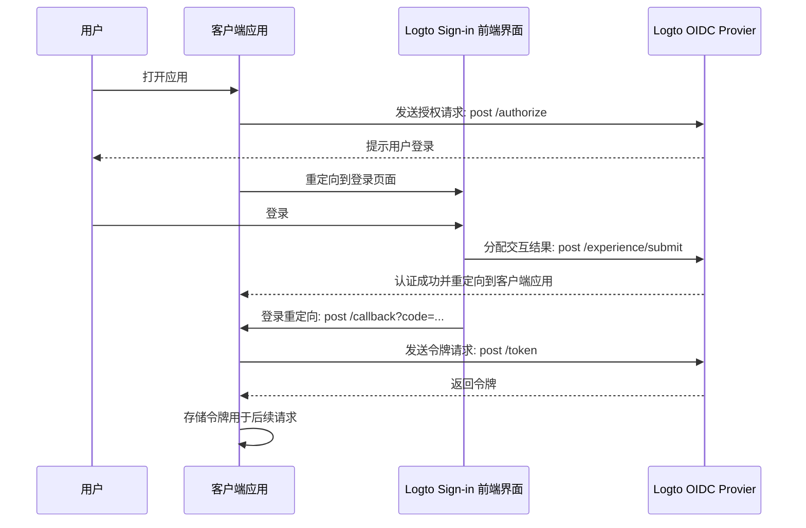

# 基于Logto的认证系统集成设计文档

## 1. 系统架构概述

### 1.1 技术栈
- 前端：React
- 后端：C++
- 认证服务：Logto (OIDC Provider)

### 1.2 系统组件
- **Logto服务**：提供OIDC认证功能，负责用户注册、登录和令牌签发
- **React前端**：用户界面，集成Logto SDK处理登录流程
- **C++后端API**：业务逻辑实现，包含JWT验证中间件

### 1.3 认证流程
1. 用户通过React前端发起登录请求
2. 前端调用Logto SDK，重定向到Logto登录页面
3. 用户在Logto完成身份验证
4. Logto返回授权码到前端
5. 前端使用授权码获取访问令牌(JWT)
6. 前端将JWT附加到后续API请求中
7. C++后端验证JWT并授权访问



## 2. 前端实现 (React)

### 2.1 依赖项
```json
{
  "dependencies": {
    "@logto/react": "^2.x.x",
    "axios": "^1.x.x",
    "react-router-dom": "^6.x.x"
  }
}
```

### 2.2 Logto配置
```javascript
// src/auth/LogtoConfig.js
export const LogtoConfig = {
  endpoint: 'https://your-logto-instance.com',
  appId: 'your-application-id',
  resources: ['your-api-resource'],
};
```

### 2.3 认证上下文
```javascript
// src/auth/AuthContext.jsx
import React, { createContext, useContext, useEffect, useState } from 'react';
import { LogtoProvider, useLogto } from '@logto/react';
import { LogtoConfig } from './LogtoConfig';

const AuthContext = createContext(null);

export const AuthProvider = ({ children }) => {
  return (
    <LogtoProvider config={LogtoConfig}>
      <AuthProviderContent>{children}</AuthProviderContent>
    </LogtoProvider>
  );
};

const AuthProviderContent = ({ children }) => {
  const { isAuthenticated, getAccessToken, signIn, signOut } = useLogto();
  const [token, setToken] = useState(null);

  useEffect(() => {
    if (isAuthenticated) {
      getAccessToken().then(setToken);
    } else {
      setToken(null);
    }
  }, [isAuthenticated, getAccessToken]);

  return (
    <AuthContext.Provider value={{ isAuthenticated, token, signIn, signOut }}>
      {children}
    </AuthContext.Provider>
  );
};

export const useAuth = () => useContext(AuthContext);
```

### 2.4 API请求封装
```javascript
// src/api/apiClient.js
import axios from 'axios';

const apiClient = axios.create({
  baseURL: 'https://your-api-endpoint.com',
});

export const setAuthToken = (token) => {
  if (token) {
    apiClient.defaults.headers.common['Authorization'] = `Bearer ${token}`;
  } else {
    delete apiClient.defaults.headers.common['Authorization'];
  }
};

export default apiClient;
```

### 2.5 受保护路由组件
```javascript
// src/components/ProtectedRoute.jsx
import React from 'react';
import { Navigate } from 'react-router-dom';
import { useAuth } from '../auth/AuthContext';

export const ProtectedRoute = ({ children }) => {
  const { isAuthenticated, signIn } = useAuth();

  if (!isAuthenticated) {
    signIn();
    return null;
  }

  return children;
};
```

## 3. 后端实现 (C++)

### 3.1 依赖库
- **JWT验证**：jwt-cpp (https://github.com/Thalhammer/jwt-cpp)
- **HTTP服务器**：Crow (https://github.com/CrowCpp/Crow) 或 Drogon (https://github.com/drogonframework/drogon)
- **JSON处理**：nlohmann/json (https://github.com/nlohmann/json)
- **HTTP客户端**：cpr (https://github.com/libcpr/cpr) 或 curl

### 3.2 JWT验证中间件

```cpp
// jwt_middleware.h
#pragma once

#include <string>
#include <functional>
#include <memory>
#include <jwt-cpp/jwt.h>
#include <nlohmann/json.hpp>

class JwtMiddleware {
public:
    JwtMiddleware(const std::string& jwks_uri);
    
    // 验证JWT令牌
    bool verify(const std::string& token, nlohmann::json& payload);
    
    // 定期更新JWKS (JSON Web Key Set)
    void update_jwks();
    
private:
    std::string jwks_uri_;
    nlohmann::json jwks_;
    std::mutex mutex_;
    
    // 从JWKS中获取公钥
    std::string get_public_key(const std::string& kid);
};

// 中间件工厂函数 (适用于Crow框架)
std::function<void(crow::request&, crow::response&, std::function<void()>)> 
jwt_auth_middleware(JwtMiddleware& jwt_middleware);
```

### 3.3 JWT验证实现

```cpp
// jwt_middleware.cpp
#include "jwt_middleware.h"
#include <cpr/cpr.h>
#include <iostream>

JwtMiddleware::JwtMiddleware(const std::string& jwks_uri) 
    : jwks_uri_(jwks_uri) {
    update_jwks();
}

void JwtMiddleware::update_jwks() {
    try {
        auto r = cpr::Get(cpr::Url{jwks_uri_});
        if (r.status_code == 200) {
            std::lock_guard<std::mutex> lock(mutex_);
            jwks_ = nlohmann::json::parse(r.text);
        } else {
            std::cerr << "Failed to fetch JWKS: " << r.status_code << std::endl;
        }
    } catch (const std::exception& e) {
        std::cerr << "Exception while fetching JWKS: " << e.what() << std::endl;
    }
}

std::string JwtMiddleware::get_public_key(const std::string& kid) {
    std::lock_guard<std::mutex> lock(mutex_);
    
    if (!jwks_.contains("keys")) {
        return "";
    }
    
    for (const auto& key : jwks_["keys"]) {
        if (key.contains("kid") && key["kid"] == kid) {
            // 从JWK转换为PEM格式的公钥
            // 注意：这里需要根据key的类型(RSA/EC)实现具体的转换逻辑
            // 简化示例，实际实现需要更复杂的转换
            return "-----BEGIN PUBLIC KEY-----\n" + 
                   std::string(key["x5c"][0]) + 
                   "\n-----END PUBLIC KEY-----";
        }
    }
    
    return "";
}

bool JwtMiddleware::verify(const std::string& token, nlohmann::json& payload) {
    try {
        // 解析JWT头部以获取kid
        auto decoded_jwt = jwt::decode(token);
        auto headers = decoded_jwt.get_header_json();
        
        if (!headers.contains("kid")) {
            return false;
        }
        
        std::string kid = headers["kid"];
        std::string public_key = get_public_key(kid);
        
        if (public_key.empty()) {
            // 如果找不到对应的公钥，尝试更新JWKS
            update_jwks();
            public_key = get_public_key(kid);
            if (public_key.empty()) {
                return false;
            }
        }
        
        // 验证JWT
        auto verifier = jwt::verify()
            .allow_algorithm(jwt::algorithm::rs256(public_key, "", "", ""))
            .with_issuer("https://your-logto-instance.com")  // 替换为你的Logto实例
            .with_audience("your-api-resource");  // 替换为你的API资源标识符
        
        verifier.verify(decoded_jwt);
        
        // 提取payload
        payload = nlohmann::json::parse(decoded_jwt.get_payload());
        return true;
    } catch (const std::exception& e) {
        std::cerr << "JWT verification failed: " << e.what() << std::endl;
        return false;
    }
}

// Crow中间件实现
std::function<void(crow::request&, crow::response&, std::function<void()>)> 
jwt_auth_middleware(JwtMiddleware& jwt_middleware) {
    return [&jwt_middleware](crow::request& req, crow::response& res, std::function<void()> next) {
        // 从请求头中获取Authorization
        auto auth_header = req.get_header_value("Authorization");
        
        if (auth_header.empty() || auth_header.substr(0, 7) != "Bearer ") {
            res.code = 401;
            res.write("Unauthorized: No token provided");
            res.end();
            return;
        }
        
        std::string token = auth_header.substr(7);
        nlohmann::json payload;
        
        if (!jwt_middleware.verify(token, payload)) {
            res.code = 401;
            res.write("Unauthorized: Invalid token");
            res.end();
            return;
        }
        
        // 将用户信息存储在请求中，供后续处理使用
        req.add_context("user", payload);
        
        // 继续处理请求
        next();
    };
}
```

### 3.4 API服务器集成示例 (使用Crow框架)

```cpp
// main.cpp
#include <crow.h>
#include "jwt_middleware.h"

int main() {
    // 初始化JWT中间件
    JwtMiddleware jwt_middleware("https://your-logto-instance.com/.well-known/jwks.json");
    
    // 创建Crow应用
    crow::App<> app;
    
    // 公开端点 - 不需要认证
    CROW_ROUTE(app, "/api/public")
    ([]() {
        return crow::response(200, "This is a public endpoint");
    });
    
    // 受保护端点 - 需要认证
    CROW_ROUTE(app, "/api/protected")
    .middlewares(jwt_auth_middleware(jwt_middleware))
    ([](const crow::request& req) {
        auto user = req.get_context<nlohmann::json>("user");
        return crow::response(200, "Protected data for user: " + user["sub"].get<std::string>());
    });
    
    // 启动服务器
    app.port(3000).multithreaded().run();
    
    return 0;
}
```

## 4. 配置和部署

### 4.1 Logto配置
1. 在Logto管理控制台创建应用
2. 配置回调URL: `http://localhost:3000/callback` (开发环境)
3. 配置API资源和权限范围
4. 获取应用ID和端点URL

### 4.2 环境变量
```
# 前端环境变量
REACT_APP_LOGTO_ENDPOINT=https://your-logto-instance.com
REACT_APP_LOGTO_APP_ID=your-application-id
REACT_APP_API_ENDPOINT=http://localhost:3000/api

# 后端环境变量
LOGTO_JWKS_URI=https://your-logto-instance.com/.well-known/jwks.json
LOGTO_ISSUER=https://your-logto-instance.com
LOGTO_AUDIENCE=your-api-resource
```

### 4.3 构建和部署流程
1. 前端构建: `npm run build`
2. 后端构建: `cmake . && make`
3. 部署前端静态文件到Web服务器
4. 部署后端API服务

## 5. 安全考虑

### 5.1 令牌存储
- 前端使用内存存储访问令牌，避免存储在localStorage
- 使用HTTP-only cookies存储刷新令牌

### 5.2 HTTPS
- 生产环境必须使用HTTPS
- 配置适当的安全头部(Content-Security-Policy, X-XSS-Protection等)

### 5.3 令牌验证
- 验证签名
- 验证过期时间
- 验证发行者和受众
- 验证令牌类型

### 5.4 权限管理
- 基于JWT中的claims实现细粒度的权限控制
- 实现基于角色的访问控制(RBAC)

## 6. 测试策略

### 6.1 单元测试
- JWT验证中间件测试
- 模拟令牌生成和验证

### 6.2 集成测试
- API端点认证测试
- 前后端集成测试

### 6.3 端到端测试
- 完整登录流程测试
- 会话管理测试