# Linux操作系统学习平台流程图文档

本文档包含Linux操作系统学习平台的核心功能流程图，用于展示系统各模块的工作流程和交互方式。

## 目录

- [Linux操作系统学习平台流程图文档](#linux操作系统学习平台流程图文档)
  - [目录](#目录)
  - [用户管理流程](#用户管理流程)
    - [用户注册与登录流程](#用户注册与登录流程)
    - [用户权限验证流程](#用户权限验证流程)
  - [学生功能流程](#学生功能流程)
    - [课程浏览与选修流程](#课程浏览与选修流程)
    - [资源获取流程](#资源获取流程)
    - [环境创建与管理流程](#环境创建与管理流程)
  - [教师功能流程](#教师功能流程)
    - [课程创建与管理流程](#课程创建与管理流程)
    - [资源上传与管理流程](#资源上传与管理流程)
    - [镜像创建与管理流程](#镜像创建与管理流程)
  - [管理员功能流程](#管理员功能流程)
    - [用户管理流程](#用户管理流程-1)
    - [系统配置流程](#系统配置流程)
    - [容器管理流程](#容器管理流程)
  - [系统核心流程](#系统核心流程)
    - [热门课程更新流程](#热门课程更新流程)
    - [容器创建与配置流程](#容器创建与配置流程)

## 用户管理流程

### 用户注册与登录流程

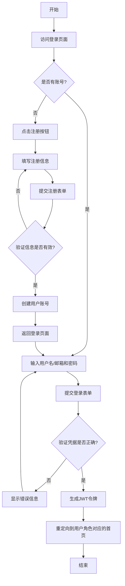

### 用户权限验证流程

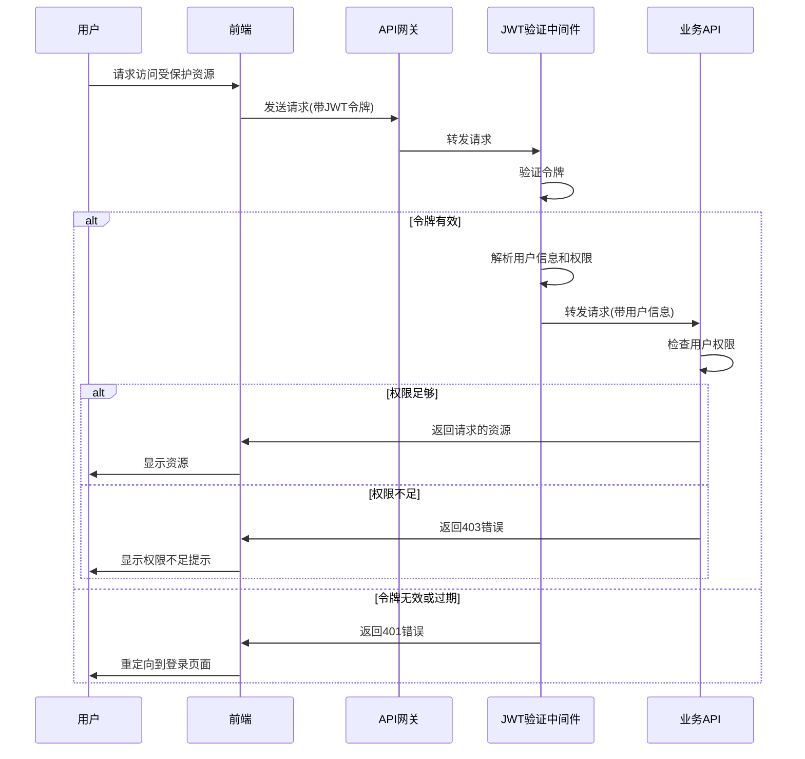

## 学生功能流程

### 课程浏览与选修流程

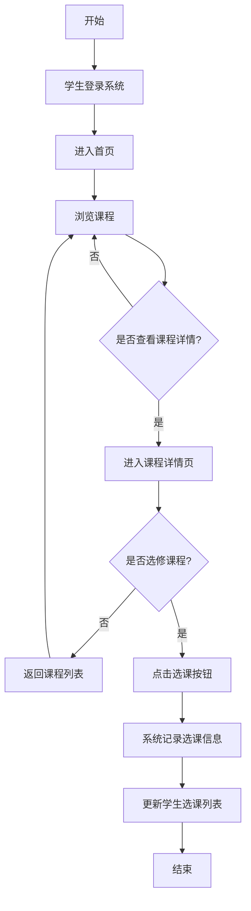

### 资源获取流程

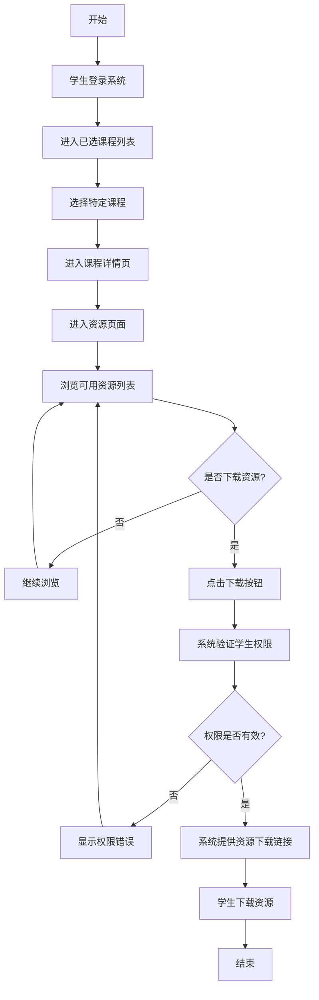

### 环境创建与管理流程

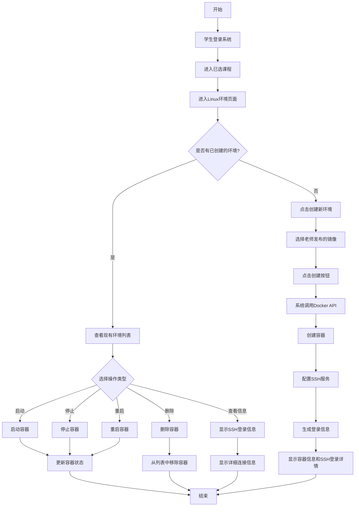

## 教师功能流程

### 课程创建与管理流程

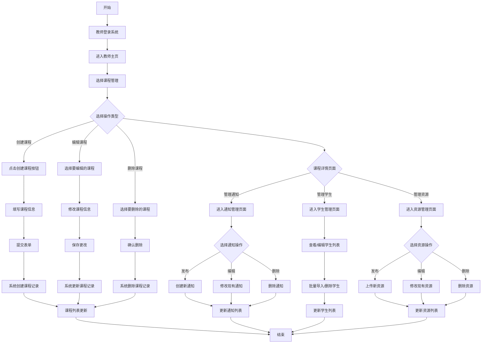

### 资源上传与管理流程

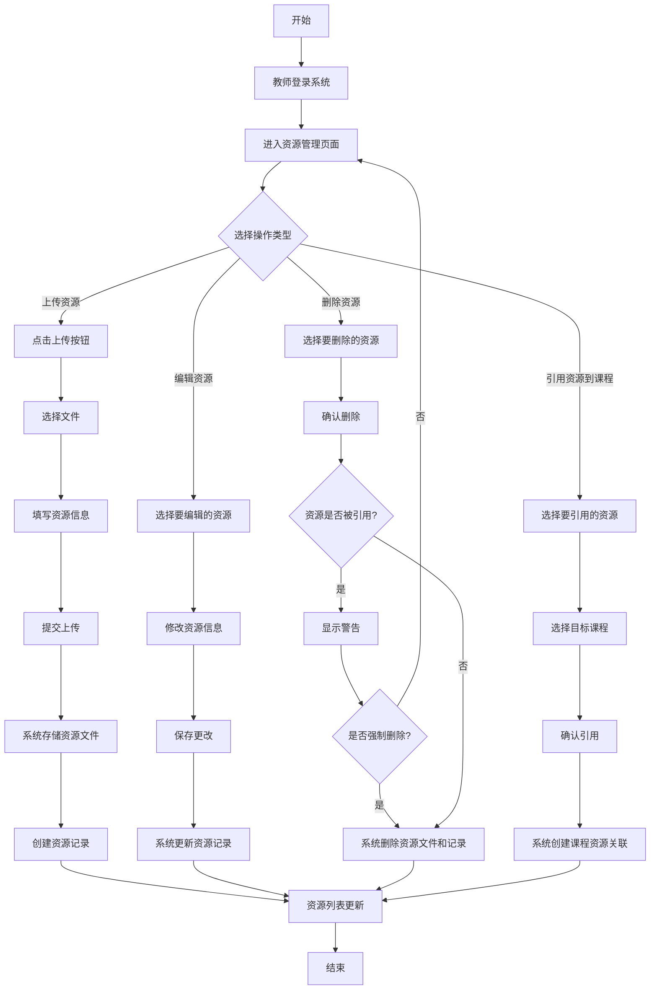

### 镜像创建与管理流程

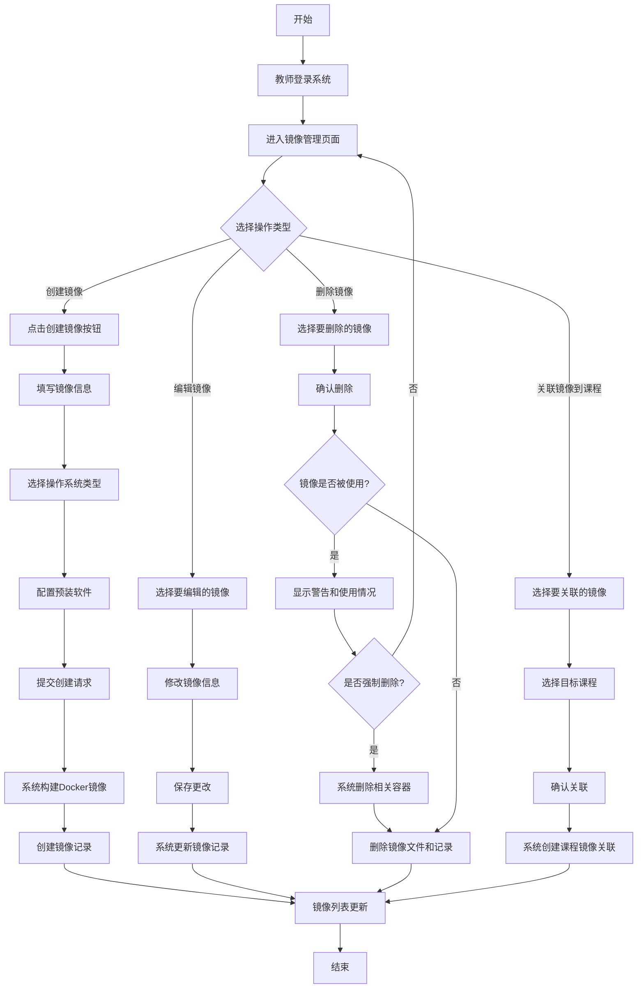

## 管理员功能流程

### 用户管理流程

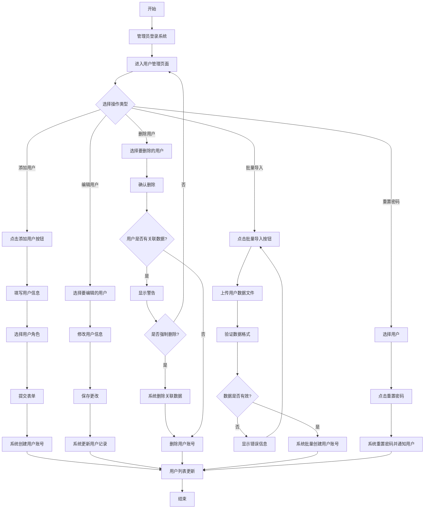

### 系统配置流程

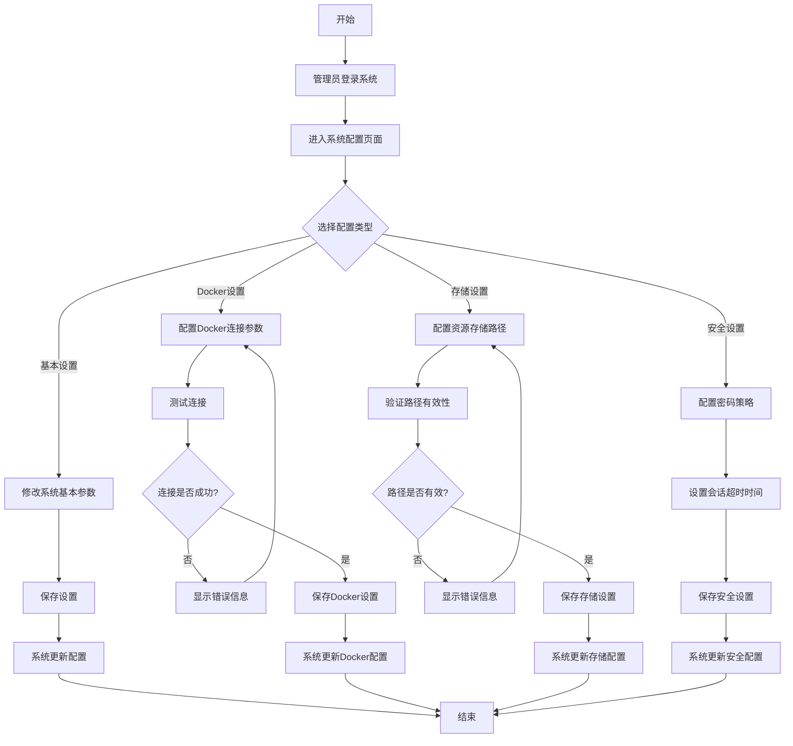

### 容器管理流程

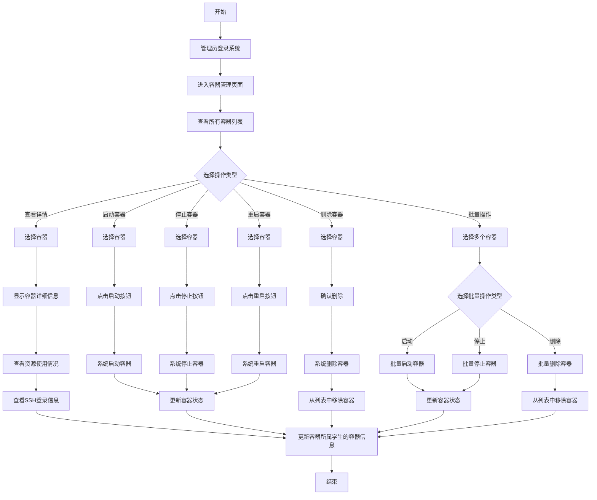

## 系统核心流程

### 热门课程更新流程

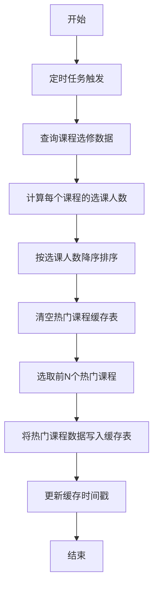

### 容器创建与配置流程

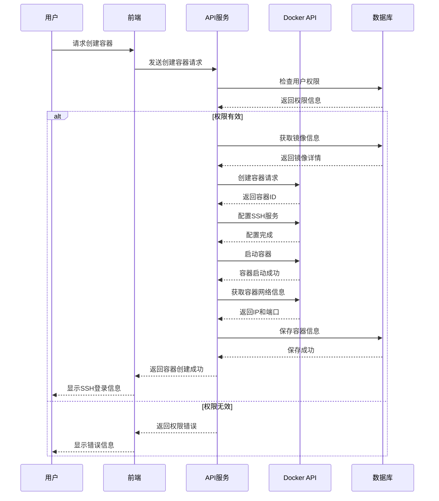
