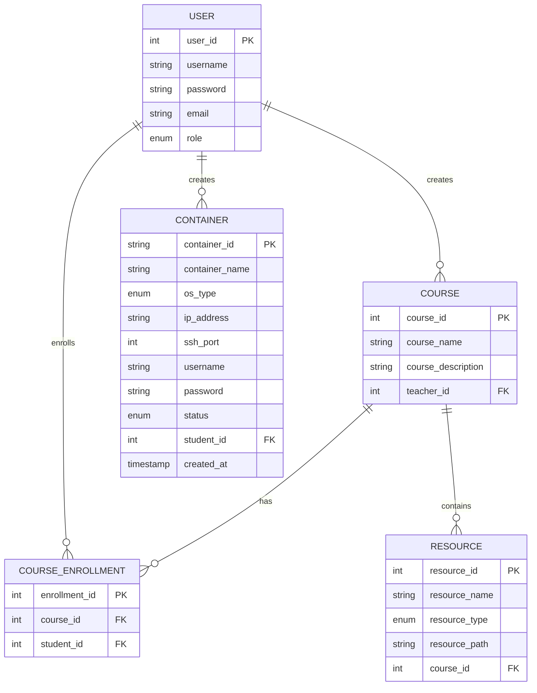

## 1. 需求分析

### 1.1 项目背景
Linux操作系统学习平台旨在为教师和学生提供一个Linux学习环境，通过该平台教师可以提供Linux操作系统的学习资源，学生可以进行Linux操作系统的安装、学习和测试，管理员可以对用户信息等进行管理。

### 1.2 用户角色
- **教师用户**：提供Linux操作系统的学习资源，包括背景资料、安装包链接，Linux系统管理课程资料等, 增删改查班级信息，增删改查学生信息。
- **学生用户**：通过平台进行Linux操作系统的安装、学习和测试等
- **管理员**：对用户信息, 班级信息, 资源等进行管理

### 1.3 功能需求

#### 1.3.1 教师功能
**用户管理模块：**

教师只能通过管理员进行导入。教师可以自己登录和个人信息管理。

**资源管理**

教师可以所有上传的资源都在这个界面汇总。在这个界面对资源编辑、删除（文档、视频、压缩包）。
在课程中公布的资源是以引用的形式公布的。（即，学生可以访问教师在班级中公布了的资源链接进行下载，对没公布的资源链接，无权访问）

**课程管理：**

教师可以创建、编辑、删除课程, 在课程中发布、编辑、删除通知, 在课程中公布资源，在课程中增删学生。

#### 1.3.2 学生功能
**用户管理：**

注册、登录、个人信息管理

**课程学习：**

学生在首页可以浏览、搜索课程。既可以加入课程，也可以从课程中退出。
进入课程页面后后有以下两种功能。
 
   2.1 资源获取页面：查看、下载学习资料

   2.2. Linux环境使用页面：选择Linux发行版（Ubuntu或CentOS），选择系统版本，获取SSH登录信息，连接到容器进行学习

#### 1.3.3 管理员功能
**用户管理：** 

增删改查用户信息，用户信息支持批量导入。

**容器管理**

对容器进行增删改查。可以以每个学生为组的查看学生创建的容器状态。

## 2. 系统功能模块设计

### 2.1 系统总体架构
Linux操作系统学习平台采用C++开发，基于B/S架构，分为前端展示层和后端处理层。

#### 2.1.1 前端展示层
- **React**：前端框架，支持组件化开发。
- **Vite**：现代化的前端构建工具，提供快速的开发服务器启动速度和高效的热更新功能。
- **shadcn/ui**：基于Tailwind CSS的现代化UI组件库。
- **Tailwind CSS**：用于样式定制，确保一致性和灵活性。
- **路由**：使用`react-router-dom`管理页面导航。
- **状态管理**：使用`React Context`管理全局状态。


#### 2.1.2 后端处理层
- 使用C++实现核心业务逻辑
- 采用SQLite数据库存储数据
- 使用Docker API管理容器

依赖库
- **JWT验证**：jwt-cpp (https://github.com/Thalhammer/jwt-cpp)
- **HTTP服务器**：Crow (https://github.com/CrowCpp/Crow)
- **JSON处理**：nlohmann/json (https://github.com/nlohmann/json)
- **数据库处理**：SQLiteCpp (https://github.com/SRombauts/SQLiteCpp)
- **日志库**：spdlog (https://github.com/gabime/spdlog)

#### 2.1.3 用户管理鉴权层
- **Logto服务**：提供OIDC认证功能，负责用户注册、登录和令牌签发
- **React前端**：用户界面，集成Logto SDK处理登录流程
- **C++后端API**：业务逻辑实现，包含JWT验证中间件

### 2.2 系统功能模块图
```
Linux操作系统学习平台
├── 用户管理模块
│   ├── 注册登录模块
│   └── 个人信息管理模块
├── 教师功能模块
│   ├── 资源管理模块
│   └── 课程管理模块
├── 学生功能模块
│   ├── 课程学习模块
│   ├── 资源获取模块
│   └── Docker容器管理模块
└── 管理员功能模块
    ├── 用户管理模块
    ├── 系统配置模块
    └── 容器管理模块
```

### 2.3 核心功能模块详细设计

#### 2.3.1 用户管理模块
- **注册登录模块**：实现用户注册、登录功能
- **个人信息管理模块**：实现用户个人信息查看、编辑功能

#### 2.3.2 教师功能模块
- **资源管理模块**：实现教学资源上传、编辑、删除功能
- **课程管理模块**：实现课程创建、编辑、删除功能

#### 2.3.3 学生功能模块
- **课程学习模块**：实现课程浏览、搜索功能
- **资源获取模块**：实现学习资料查看、下载功能
- **Docker容器管理模块**：实现Linux发行版选择、容器创建、SSH登录信息获取功能

#### 2.3.4 管理员功能模块
- **用户管理模块**：实现用户信息查看、编辑、删除功能
- **系统配置模块**：实现系统参数设置功能
- **容器管理模块**：实现Docker容器查看、管理功能

### 2.4 Docker容器管理功能实现方案

系统将使用Docker容器为每个学生提供独立的Linux环境。具体实现方案如下：

1. **容器创建流程**：
   - 学生登录平台，进入Docker容器管理页面
   - 选择Linux发行版（Ubuntu或CentOS）
   - 点击创建按钮，系统后台调用Docker API创建对应的容器
   - 容器内自动配置SSH服务
   - 创建完成后，系统显示容器的SSH登录信息（IP地址、端口、用户名和密码）
   - 学生使用SSH客户端（如PuTTY、Terminal等）连接到容器进行学习

2. **容器管理功能**：
   - 创建容器：选择Linux发行版，创建新的Docker容器
   - 启动/停止容器：控制容器的运行状态
   - 重启容器：重启容器服务
   - 删除容器：删除不再需要的容器
   - 查看容器信息：显示容器的详细信息，包括SSH登录信息

3. **技术实现**：
   - 使用Docker API或Docker命令行工具创建和管理容器
   - 容器基础镜像预先配置好SSH服务
   - 容器创建时自动生成随机密码，并配置到容器中
   - 使用端口映射将容器内的SSH端口映射到宿主机上

这种方案相比预配置服务器更加灵活，可以根据学生的需求动态创建不同类型的Linux环境，同时资源消耗也比完整的虚拟机要小得多。

## 3. 数据库设计

### 3.1 数据库概念结构设计

#### 3.1.1 E-R图

以下是主要实体及其关系：

1. **用户实体**
   - 属性：用户ID、用户名、密码、邮箱、角色
   - 关系：一个用户可以是教师、学生或管理员

2. **课程实体**
   - 属性：课程ID、课程名称、课程描述
   - 关系：一个课程由一个教师创建，多个学生选修

3. **资源实体**
   - 属性：资源ID、资源名称、资源类型、资源路径
   - 关系：一个资源属于一个课程，由一个教师上传

4. **容器实体**
   - 属性：容器ID、容器名称、Linux发行版、IP地址、SSH端口、用户名、密码、状态
   - 关系：一个容器由一个学生创建和使用

### 3.2 数据库逻辑结构设计

#### 3.2.1 E-R图转换为关系模式

1. **用户表(User)**
   ```sql
   CREATE TABLE User (
       user_id INTEGER PRIMARY KEY AUTOINCREMENT,
       username TEXT NOT NULL UNIQUE,
       password TEXT NOT NULL,
       email TEXT NOT NULL UNIQUE,
       role TEXT NOT NULL CHECK(role IN ('teacher', 'student', 'admin'))
   );
   ```

2. **课程表(Course)**
   ```sql
   CREATE TABLE Course (
       course_id INTEGER PRIMARY KEY AUTOINCREMENT,
       course_name TEXT NOT NULL,
       course_description TEXT,
       teacher_id INTEGER NOT NULL,
       FOREIGN KEY (teacher_id) REFERENCES User(user_id)
   );
   ```

3. **课程选修表(CourseEnrollment)**
   ```sql
   CREATE TABLE CourseEnrollment (
       enrollment_id INTEGER PRIMARY KEY AUTOINCREMENT,
       course_id INTEGER NOT NULL,
       student_id INTEGER NOT NULL,
       FOREIGN KEY (course_id) REFERENCES Course(course_id),
       FOREIGN KEY (student_id) REFERENCES User(user_id),
       UNIQUE (course_id, student_id)
   );
   ```

4. **资源表(Resource)**
   ```sql
   CREATE TABLE Resource (
       resource_id INTEGER PRIMARY KEY AUTOINCREMENT,
       resource_name TEXT NOT NULL,
       resource_type TEXT NOT NULL CHECK(resource_type IN ('document', 'archive')),
       resource_path TEXT NOT NULL,
       course_id INTEGER NOT NULL,
       FOREIGN KEY (course_id) REFERENCES Course(course_id)
   );
   ```

5. **容器表(Container)**
   ```sql
   CREATE TABLE Container (
       container_id TEXT PRIMARY KEY,  -- Docker容器ID
       container_name TEXT NOT NULL,
       os_type TEXT NOT NULL CHECK(os_type IN ('ubuntu', 'centos')),
       ip_address TEXT NOT NULL,
       ssh_port INTEGER NOT NULL,
       username TEXT NOT NULL,
       password TEXT NOT NULL,
       status TEXT NOT NULL CHECK(status IN ('running', 'stopped', 'error')),
       student_id INTEGER NOT NULL,
       created_at TIMESTAMP DEFAULT CURRENT_TIMESTAMP,
       FOREIGN KEY (student_id) REFERENCES User(user_id)
   );
   ```

#### 3.2.2 属性的数据类型确定

1. **用户表(User)**
   - user_id: INTEGER (自增主键)
   - username: TEXT (用户名，唯一)
   - password: TEXT (密码，加密存储)
   - email: TEXT (邮箱，唯一)
   - role: TEXT (用户角色，限制为'teacher', 'student', 'admin')

2. **课程表(Course)**
   - course_id: INTEGER (自增主键)
   - course_name: TEXT (课程名称)
   - course_description: TEXT (课程描述)
   - teacher_id: INTEGER (外键，关联用户表)

3. **课程选修表(CourseEnrollment)**
   - enrollment_id: INTEGER (自增主键)
   - course_id: INTEGER (外键，关联课程表)
   - student_id: INTEGER (外键，关联用户表)

4. **资源表(Resource)**
   - resource_id: INTEGER (自增主键)
   - resource_name: TEXT (资源名称)
   - resource_type: TEXT (资源类型，限制为'document', 'archive')
   - resource_path: TEXT (资源路径)
   - course_id: INTEGER (外键，关联课程表)

5. **容器表(Container)**
   - container_id: TEXT (主键，Docker容器ID)
   - container_name: TEXT (容器名称)
   - os_type: TEXT (操作系统类型，限制为'ubuntu', 'centos')
   - ip_address: TEXT (IP地址)
   - ssh_port: INTEGER (SSH端口)
   - username: TEXT (用户名)
   - password: TEXT (密码)
   - status: TEXT (容器状态，限制为'running', 'stopped', 'error')
   - student_id: INTEGER (外键，关联用户表)
   - created_at: TIMESTAMP (创建时间)

## 4. 用户权限与页面设计

### 4.1 用户权限设计

#### 4.1.1 教师权限
- 管理个人信息
- 创建、编辑、删除课程
- 上传、编辑、删除教学资源

#### 4.1.2 学生权限
- 管理个人信息
- 浏览、搜索、选修课程
- 查看、下载学习资料
- 创建、管理Docker容器，通过SSH登录容器

#### 4.1.3 管理员权限
- 管理所有用户信息
- 管理系统配置
- 管理所有Docker容器

### 4.2 页面设计

#### 4.2.1 公共页面
1. **登录页面**：用户登录界面
2. **注册页面**：用户注册界面
3. **个人信息页面**：用户查看、编辑个人信息界面

#### 4.2.2 教师页面
1. **教师主页**：显示教师课程、资源等概览
2. **课程管理页面**：创建、编辑、删除课程
3. **资源管理页面**：上传、编辑、删除教学资源

#### 4.2.3 学生页面
1. **学生主页**：显示学生课程、容器等概览
2. **课程列表页面**：浏览、搜索、选修课程
3. **课程详情页面**：查看课程详情、资源列表
4. **资源页面**：查看、下载学习资料
5. **容器管理页面**：创建、管理Docker容器
6. **容器详情页面**：查看容器详情，包括SSH登录信息

#### 4.2.4 管理员页面
1. **管理员主页**：显示系统概览
2. **用户管理页面**：查看、编辑、删除用户信息
3. **容器管理页面**：查看、管理所有Docker容器

## 5. 技术实现方案

### 5.1 前端技术栈
- **HTML5/CSS3/JavaScript**：基础前端技术
- **Bootstrap**：响应式UI框架

### 5.2 后端技术栈
- **C++**：核心业务逻辑实现
- **Crow**：C++的轻量级Web框架
- **SQLite**：嵌入式关系型数据库
- **Docker API**：管理Docker容器
- **JSON**：数据交换格式
- **spdlog**：C++的日志库

### 5.3 Docker容器配置
- **基础镜像**：Ubuntu和CentOS官方镜像
- **预安装软件**：SSH服务器、基础开发工具
- **安全配置**：限制容器资源使用

### 5.4 系统部署方案
- **单机部署**：将系统部署在一台服务器上，同时运行Web服务、数据库服务和Docker服务
