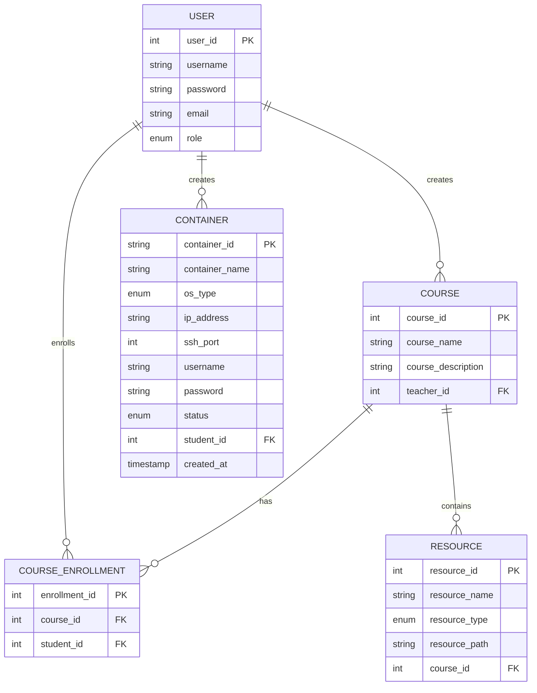

# Linux操作系统学习平台数据库E-R图（精简版）

## 1. 实体关系图



## 2. 实体属性详细说明

### 2.1 用户实体(USER)
- **user_id**: 用户ID，主键，自增
- **username**: 用户名，唯一
- **password**: 密码，加密存储
- **email**: 邮箱，唯一
- **role**: 用户角色，枚举类型('teacher', 'student', 'admin')

### 2.2 课程实体(COURSE)
- **course_id**: 课程ID，主键，自增
- **course_name**: 课程名称
- **course_description**: 课程描述
- **teacher_id**: 教师ID，外键，关联用户表

### 2.3 课程选修实体(COURSE_ENROLLMENT)
- **enrollment_id**: 选修ID，主键，自增
- **course_id**: 课程ID，外键，关联课程表
- **student_id**: 学生ID，外键，关联用户表

### 2.4 资源实体(RESOURCE)
- **resource_id**: 资源ID，主键，自增
- **resource_name**: 资源名称
- **resource_type**: 资源类型，枚举类型('document', 'archive')
- **resource_path**: 资源路径
- **course_id**: 课程ID，外键，关联课程表

### 2.5 容器实体(CONTAINER)
- **container_id**: 容器ID，主键，Docker容器ID
- **container_name**: 容器名称
- **os_type**: 操作系统类型，枚举类型('ubuntu', 'centos')
- **ip_address**: IP地址
- **ssh_port**: SSH端口
- **username**: 用户名
- **password**: 密码
- **status**: 容器状态，枚举类型('running', 'stopped', 'error')
- **student_id**: 学生ID，外键，关联用户表
- **created_at**: 创建时间

## 3. 实体关系说明

1. **用户-课程关系**：
   - 一个教师可以创建多个课程
   - 一个课程只能由一个教师创建

2. **用户-课程选修关系**：
   - 一个学生可以选修多个课程
   - 一个课程可以被多个学生选修

3. **课程-资源关系**：
   - 一个课程可以包含多个资源
   - 一个资源只能属于一个课程

4. **用户-容器关系**：
   - 一个学生可以创建多个Docker容器
   - 一个容器只能由一个学生创建和使用

## 4. 数据库表结构

### 4.1 用户表(User)
```sql
CREATE TABLE User (
    user_id INTEGER PRIMARY KEY AUTOINCREMENT,
    username TEXT NOT NULL UNIQUE,
    password TEXT NOT NULL,
    email TEXT NOT NULL UNIQUE,
    role TEXT NOT NULL CHECK(role IN ('teacher', 'student', 'admin'))
);
```

### 4.2 课程表(Course)
```sql
CREATE TABLE Course (
    course_id INTEGER PRIMARY KEY AUTOINCREMENT,
    course_name TEXT NOT NULL,
    course_description TEXT,
    teacher_id INTEGER NOT NULL,
    FOREIGN KEY (teacher_id) REFERENCES User(user_id)
);
```

### 4.3 课程选修表(CourseEnrollment)
```sql
CREATE TABLE CourseEnrollment (
    enrollment_id INTEGER PRIMARY KEY AUTOINCREMENT,
    course_id INTEGER NOT NULL,
    student_id INTEGER NOT NULL,
    FOREIGN KEY (course_id) REFERENCES Course(course_id),
    FOREIGN KEY (student_id) REFERENCES User(user_id),
    UNIQUE (course_id, student_id)
);
```

### 4.4 资源表(Resource)
```sql
CREATE TABLE Resource (
    resource_id INTEGER PRIMARY KEY AUTOINCREMENT,
    resource_name TEXT NOT NULL,
    resource_type TEXT NOT NULL CHECK(resource_type IN ('document', 'archive')),
    resource_path TEXT NOT NULL,
    course_id INTEGER NOT NULL,
    FOREIGN KEY (course_id) REFERENCES Course(course_id)
);
```

### 4.5 容器表(Container)
```sql
CREATE TABLE Container (
    container_id TEXT PRIMARY KEY,  -- Docker容器ID
    container_name TEXT NOT NULL,
    os_type TEXT NOT NULL CHECK(os_type IN ('ubuntu', 'centos')),
    ip_address TEXT NOT NULL,
    ssh_port INTEGER NOT NULL,
    username TEXT NOT NULL,
    password TEXT NOT NULL,
    status TEXT NOT NULL CHECK(status IN ('running', 'stopped', 'error')),
    student_id INTEGER NOT NULL,
    created_at TIMESTAMP DEFAULT CURRENT_TIMESTAMP,
    FOREIGN KEY (student_id) REFERENCES User(user_id)
);