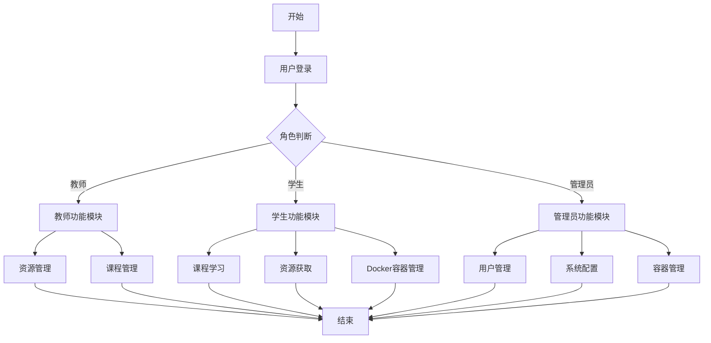
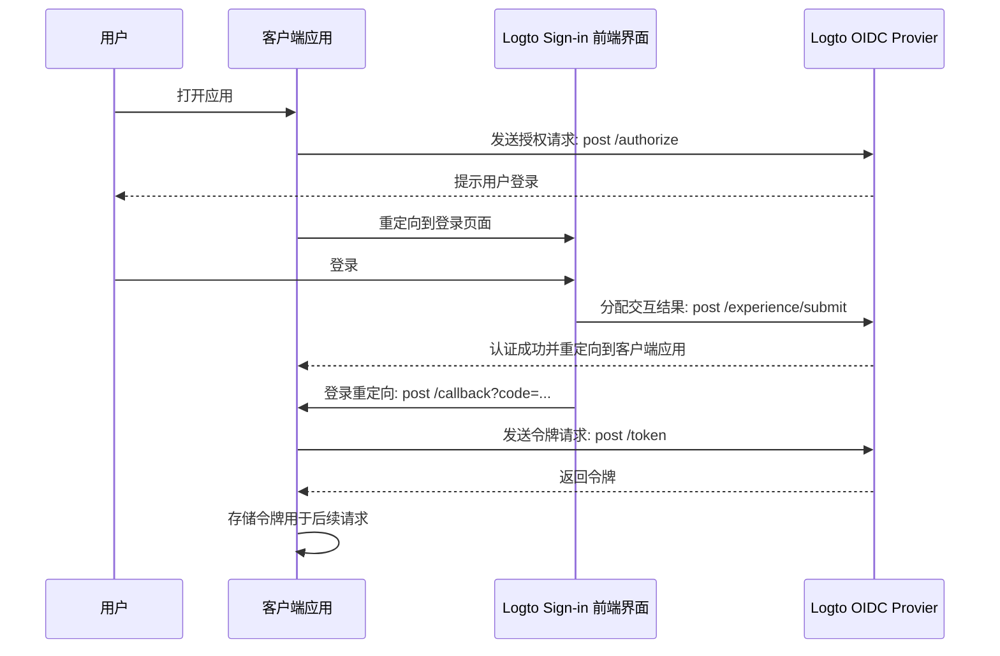
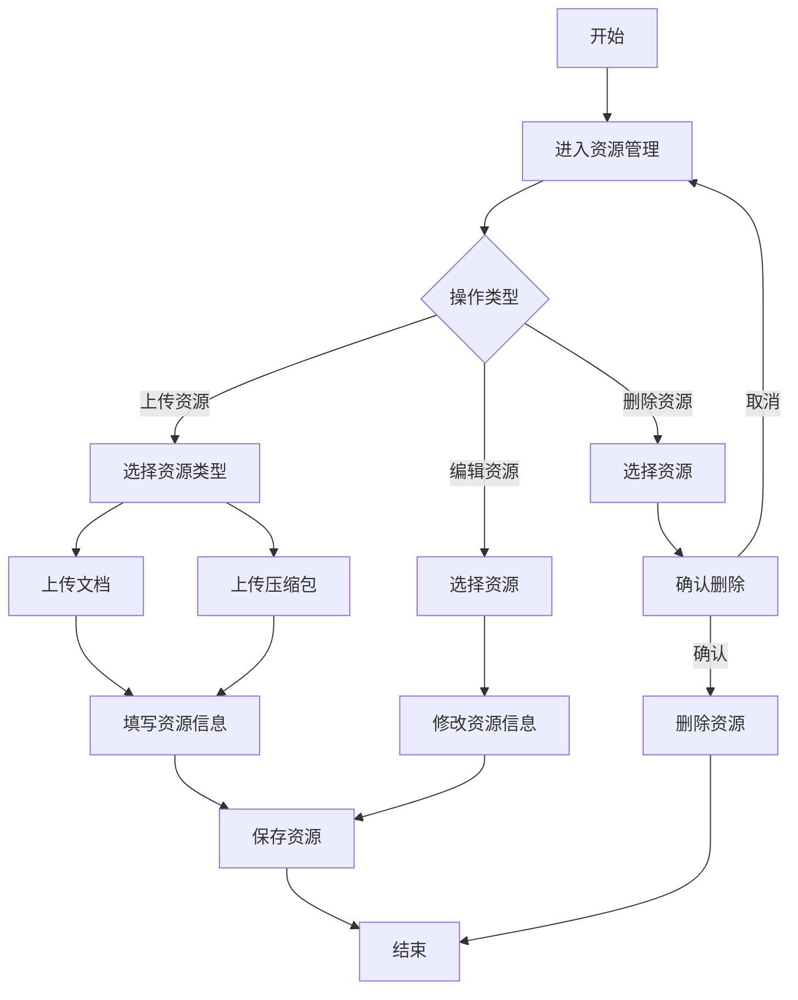
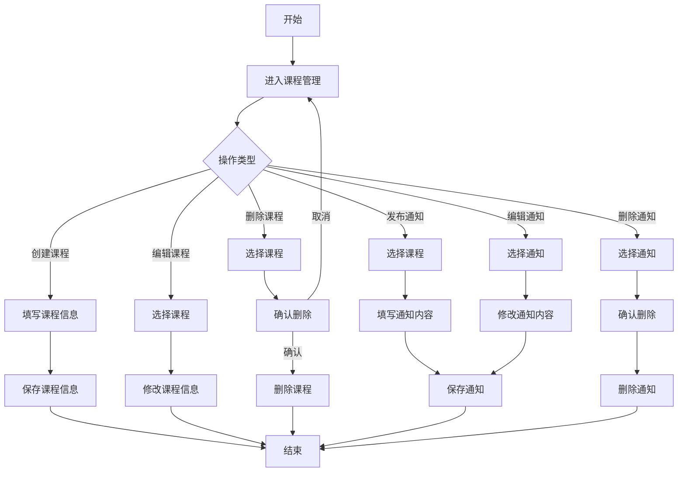
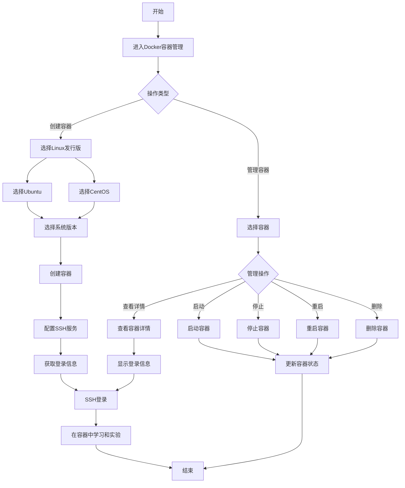
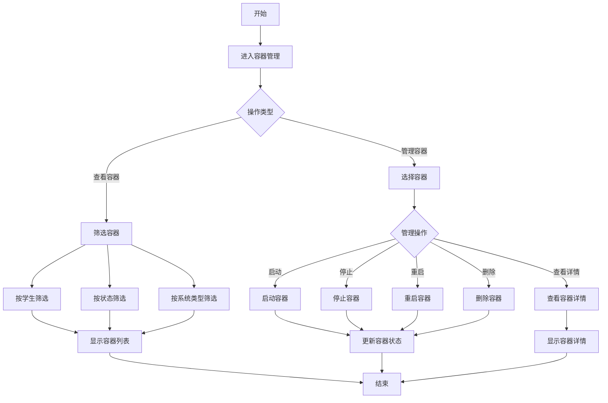

# Linux操作系统学习平台系统流程图（精简版）

## 1. 系统总体流程图



## 2. 用户注册登录流程图



## 3. 教师资源管理流程图


## 4. 教师课程管理流程图



## 4. 学生Docker容器管理流程图



## 5. 管理员容器管理流程图



## 6. Logto认证流程详细图

```mermaid
sequenceDiagram
    participant User as 用户
    participant Client as 客户端应用
    box Logto
    participant SignIn as Sign-in experience app
    participant OIDC as OIDC provider
    end

    User->>Client: 打开应用
    Client->>OIDC: 发送授权请求: post /authorize
    OIDC-->>User: 提示用户登录
    Client->>SignIn: 重定向到登录页面
    User->>SignIn: 登录
    SignIn->>OIDC: 分配交互结果: post /experience/submit
    OIDC-->>Client: 认证成功并重定向到客户端应用
    SignIn->>Client: 登录重定向: post /callback?code=...
    Client->>OIDC: 发送令牌请求: post /token
    OIDC-->>Client: 返回令牌
    Note over Client: 存储令牌用于后续请求